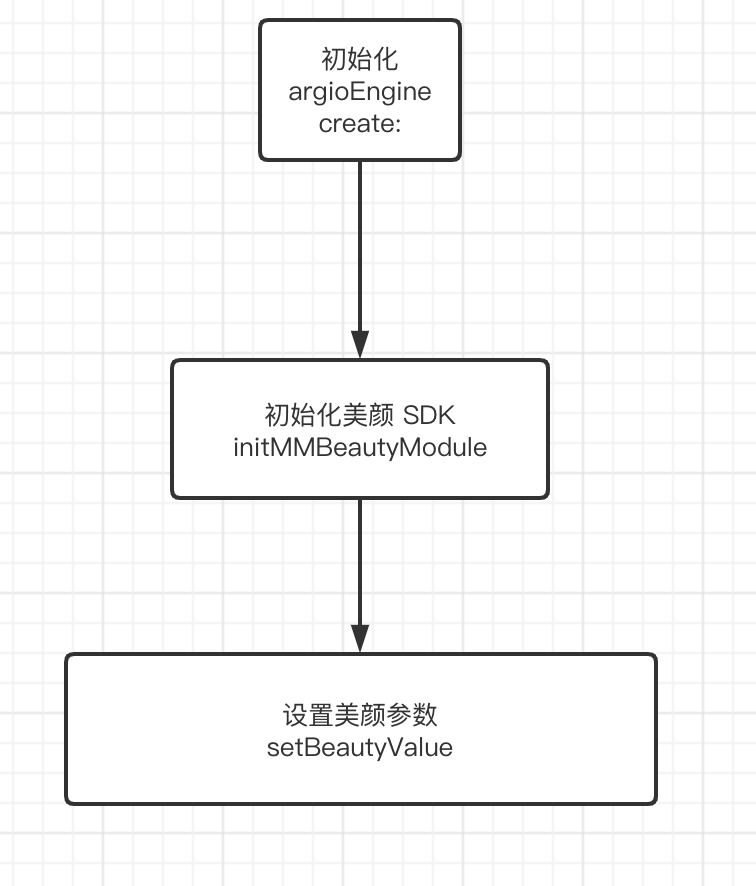

# 陌陌美颜 SDK API 说明
```c++
  ///初始化美颜 SDK 
  Future<void> initMMBeautyModule(String mmBeautyAppId);
  ///基础美颜 (美颜类型 参考 rtc_engine.dart : 3354 )
  Future<void> setBeautyValue(String beautyType, double value);

  ///一键美颜 (类型参考 rtc_engine.dart :  3459)
  Future<void> setAutoBeauty(String autoType);

  ///设置美白版本 (0  1, 2 ) 三个版本
  Future<void> setWhittenVersion(int version);

  ///设置红润版本 (0 , 1) 2 个版本
  Future<void> setReddenVersion(int version);
  ///滤镜
  Future<void> setLookupEffect(String path);

  //滤镜浓度
  Future<void> setLookupIntensity(double value);

  ///添加贴纸
  Future<void> addMaskModel(String maskPath);

  ///清除贴纸
  Future<void> clearMask();

  ///添加美妆
  Future<void> addMakeup(String path);

  ///移除贴纸
  Future<void> removeMakeup(String type);

  ///修改口红质地
  Future<void> changeLipTextureType(int type);

  //清除贴纸
  Future<void> clearMakeup();
```

## 特殊说明 : 
美颜 SDK 必须先初始化之后 在设置参数, 美颜 SDK 的初始化必须放在 engine 初始化之后 

